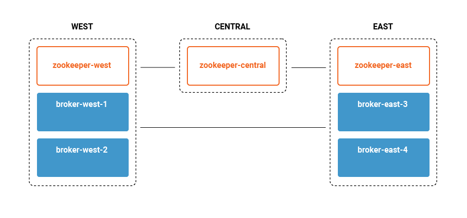
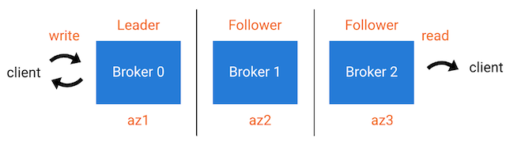

# Confluent MRC Workshop for Systems Engineers

Based on the MRC demo so we can use that as followup and be familiar with it's moving parts, but with key settings removed so everyone can learn what it takes to add MRC to a cluster or configuration.

Big Thanks to Yeva for creating such a great demo infrastructure!

# Overview

This workshop will start with deploying a local cluster with MRC set up and follow through with deploying a few different topologies to achive sync or async topics.

We will be running on our laptop so only have 4 brokers instead of the usual 6 to start.


# PREWORK

The goal of the prework section is to download all the tooling required and get the cluster running before we lose good internet on the cruise ship. Please complete this by Sunday Evening, or be prepared for long download times on the boat.

## Perequsites

1) Have docker installed on your laptop
2) Have git installed on your laptop

## Step 1 - Get the Workshop from Github

git clone this repository from CLI

```
https://github.com/cwgdata/mrc_workshop
```

## Step 2 - Build the Docker Compose

Now we need to add the MRC settings for rack awareness and the new replica selector.

First, open the docker_compose.yml and add the following to the two "west" brokers in the environment section:

```
      KAFKA_BROKER_RACK: 'west'
      KAFKA_REPLICA_SELECTOR_CLASS: org.apache.kafka.common.replica.RackAwareReplicaSelector
```

Then add the following to the two "east" brokers:

```
      KAFKA_BROKER_RACK: 'east'
      KAFKA_REPLICA_SELECTOR_CLASS: org.apache.kafka.common.replica.RackAwareReplicaSelector
```

These settings allow confluent-server to know that we are using rack awareness and what "rack" each one is set to. These racks will represent regional datacenters for the purpose of this exercise.


## Step 3 - Start Docker Compose

Run the following command.

```
docker-compose up -d
```

## Step 4 -- Confirm  your environment

You should see the following Docker containers with `docker-compose ps`:

```
      Name                   Command            State                            Ports                          
----------------------------------------------------------------------------------------------------------------
broker-east-3       /etc/confluent/docker/run   Up      0.0.0.0:8093->8093/tcp, 9092/tcp, 0.0.0.0:9093->9093/tcp
broker-east-4       /etc/confluent/docker/run   Up      0.0.0.0:8094->8094/tcp, 9092/tcp, 0.0.0.0:9094->9094/tcp
broker-west-1       /etc/confluent/docker/run   Up      0.0.0.0:8091->8091/tcp, 0.0.0.0:9091->9091/tcp, 9092/tcp
broker-west-2       /etc/confluent/docker/run   Up      0.0.0.0:8092->8092/tcp, 0.0.0.0:9092->9092/tcp          
zookeeper-central   /etc/confluent/docker/run   Up      2181/tcp, 0.0.0.0:2182->2182/tcp, 2888/tcp, 3888/tcp    
zookeeper-east      /etc/confluent/docker/run   Up      2181/tcp, 0.0.0.0:2183->2183/tcp, 2888/tcp, 3888/tcp    
zookeeper-west      /etc/confluent/docker/run   Up      0.0.0.0:2181->2181/tcp, 2888/tcp, 3888/tcp 
```

## Step 5 - Workshop Architecture

This workshop simulations an architecture with three regions/datacenters `west`, `central`, and `east`. Brokers and zookeepers are named based on the region they will be deployed in. We will have two brokers in each of the the east and west regions and a single zookeeper in each region.




## Step 6 - Review Concepts

_Replicas_ are brokers assigned to a topic-partition, and they can be a _Leader_, _Follower_, or _Observer_.
A _Leader_ is the broker/replica accepting produce messages.
A _Follower_ is a broker/replica that can join an ISR list and participate in the calculation of the high watermark (used by the leader when acknowledging messages back to the producer).

An _ISR_ list (in-sync replicas) includes brokers that have a given topic-partition.
The data is copied from the leader to every member of the ISR before the producer gets an acknowledgement.
The followers in an ISR can become the leader if the current leader fails.

An _Observer_ is a broker/replica that also has a copy of data for a given topic-partition, and consumers are allowed to read from them even though it is not the leader (known as "Follower Fetching").
However, the data is copied asynchronously from the leader such that a producer does not wait on observers to get back an acknowledgement.
By default, observers do not participate in the ISR list and cannot automatically become the leader if the current leader fails, but if a user manually changes leader assignment then they can participate in the ISR list.



# Workshop Steps

## Lab 1 - Create an Asynchronus Topic

First, open your favorite text editor to create the file config/placement-multi-region-sync.json.

We will use observer replicas in the east datacenter, and replicate asynchronusly to those observers.

Paste the following to create the topology with 2 replicas in DC West and 2 Observers in DC East.

```
{
    "version": 1,
    "replicas": [
        {
            "count": 2,
            "constraints": {
                "rack": "west"
            }
        }
    ],
    "observers": [
        {
        "count": 2,
            "constraints": {
                "rack": "east"
            }
        }
    ]
}
```

Once that file is saved, create the topic with the following command:

```
docker-compose exec broker-west-1 kafka-topics  --create \
	--bootstrap-server broker-west-1:19091 \
	--topic multi-region-sync \
	--partitions 1 \
	--replica-placement /etc/kafka/demo/placement-multi-region-sync.json \
	--config min.insync.replicas=1
```


